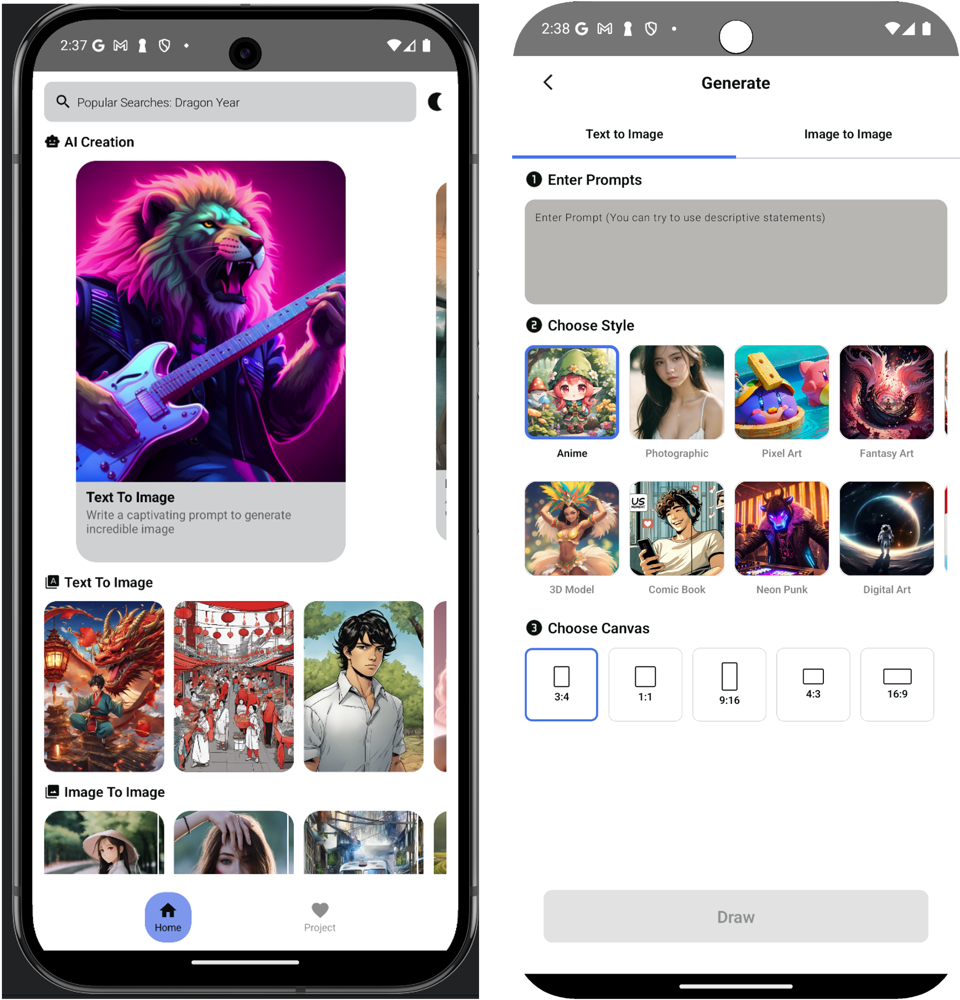
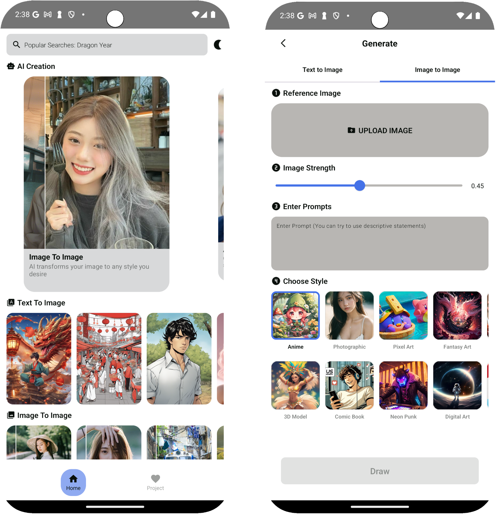
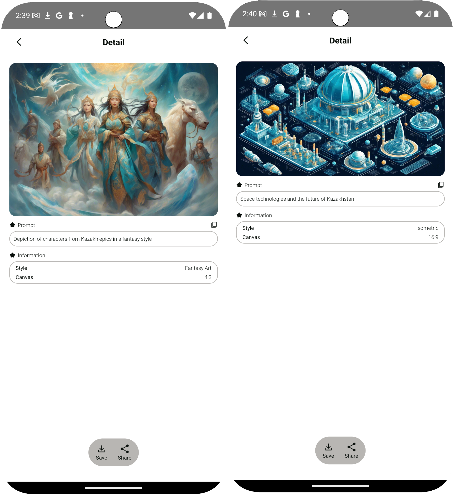

# KMM Image Generation App — Stable Diffusion on Mobile

This project focuses on **mathematical modeling of image generation systems**, evaluating their performance, and integrating them into a **mobile application**.  
The main goal is to explore AI-based image generation methods and develop an efficient system for practical use.

## Key Features

- **Text-to-Image**: Generate images from text prompts
- **Image-to-Image**: Transform existing images with AI
- **Multiple styles**: Support for diverse artistic styles
- **Parameter control**: Adjust generation parameters (resolution, steps, guidance, etc.)
- **Image editing**: Modify uploaded images directly in the app
- **Cross-platform support**: Built with Kotlin Multiplatform Mobile (KMM)
- **Optimized performance**: Quantization and model optimization for mobile devices

## Research Objectives

- Explore theoretical foundations of image generation, focusing on **Stable Diffusion**
- Study technologies required for cross-platform mobile apps with **KMM**
- Investigate technical aspects of integrating diffusion models into mobile apps
- Develop a user-friendly interface with generation parameter controls
- Test the app across different devices and evaluate performance
- Compare results with alternative generation methods

## Technology Stack

- **Kotlin Multiplatform Mobile (KMM)** — cross-platform mobile development
- **Stable Diffusion** — AI image generation model
- **PyTorch / ONNX Runtime** — model optimization and deployment
- **Jetpack Compose / SwiftUI** — UI for Android and iOS
- **Firebase** — authentication, storage, and cloud integration
- **REST API** — communication between client and backend

## Scientific & Practical Value

- **Scientific significance**: Provides insights into applying Stable Diffusion on mobile platforms and proposes optimization methods
- **Practical significance**: Enables users to generate high-quality images anytime, anywhere, directly on mobile devices

## Future Plans

- Implement **AI Inpainting** for partial image editing and restoration
- Optimize diffusion algorithms for faster and lighter mobile deployment
- Enhance user experience with interactive graphics and animations
- Improve cross-device stability and resource efficiency
- Expand functionality for creative industries (art, design, games, marketing)

## Project Structure

- **Chapter 1**: Theoretical foundations of ML and image generation (Stable Diffusion)
- **Chapter 2**: Technologies for mobile app development (KMM, model integration)
- **Chapter 3**: System architecture, algorithm integration, UI development
- **Chapter 4**: Experimental research, performance evaluation, comparison of results
- **Conclusion**: Summary of key findings and future improvements

## Screenshots

## Contact

If you have any questions or collaboration proposals, feel free to contact:  
📧 **lmuratmekqyzy@gmail.com**
